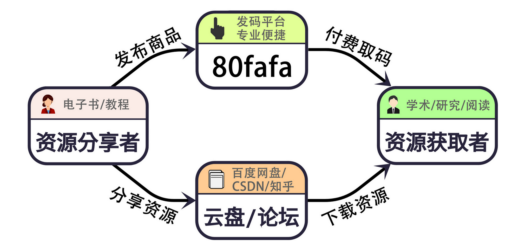

## 引言

80fafa 是一个轻量、简洁高效、专业的知识分享付费取码平台，只要你有想要分享的资源，都可以发布创建商品，获得相应二维码，然后将分享内容和二维码打包分享到各大资源分享的平台，让别人扫码购买。

（关系图）

## 特点

这个网站最大的特点就是**超级简单、门槛超低、效率很高**，你完全不用懂技术。

- **发布商品：**  不管你是 PPT 模板达人、电子书收藏家、原创音乐人还是攻略小能手，只要你有想分享的任何数字资源（文档、图片、音频、视频、软件包...），上传到这个网站，填写商品名称和价格（几分钱到几十块都行），它瞬间就变成了一个待售的“小商品”。

- **专属收款二维码：**  商品发布创建完成后，网站会给你生成一个专属的二维码。这个二维码就是你的“收银台”+“钥匙”。

- **安全性：**  你的原始资源始终是安全的！别人不扫码付钱，就绝对看不到、拿不到你分享的内容，避免了被“白嫖”。

- **分享资源：**  拿到二维码后，配上你的资源介绍（比如“史上最全 XX 攻略，免费/扫码获取”）进行打包，将链接分享到各大社交平台——微信朋友圈、QQ 群、微博、小红书、知乎... 只要有人的地方，就能被看见，就有卖出的可能性。

## 总结

这是一个低门槛，简洁高效的平台，任何人都可以使用。
