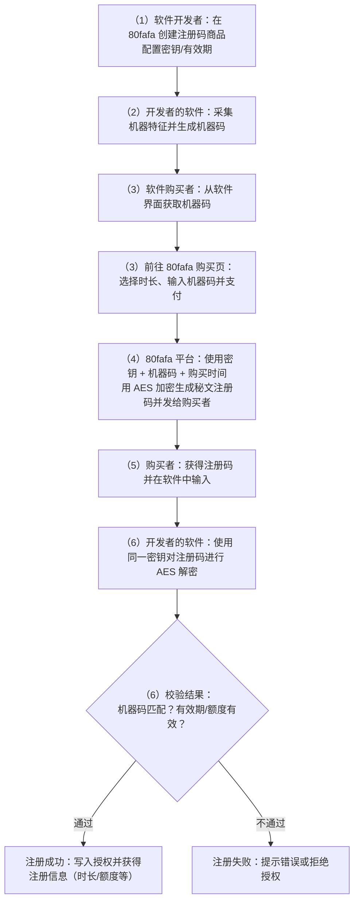
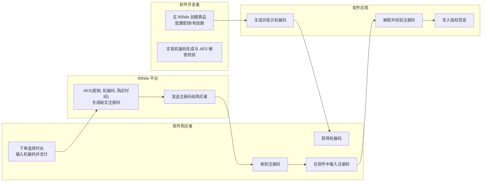
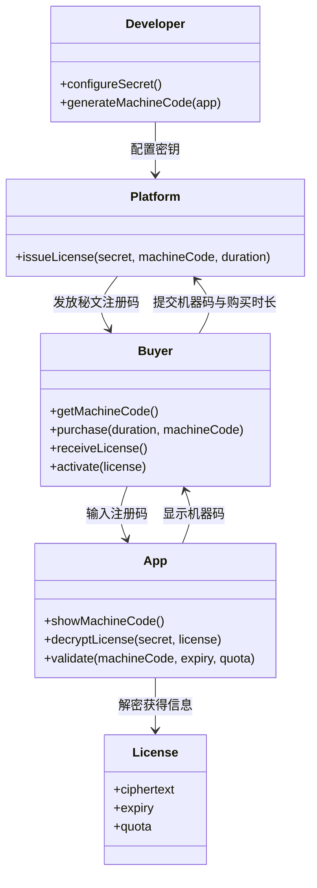
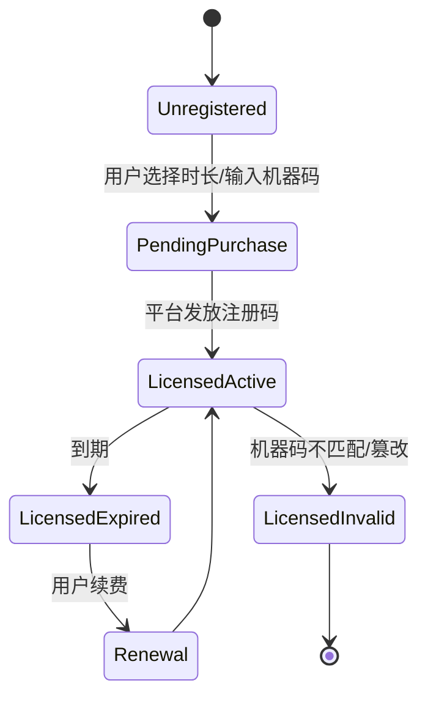
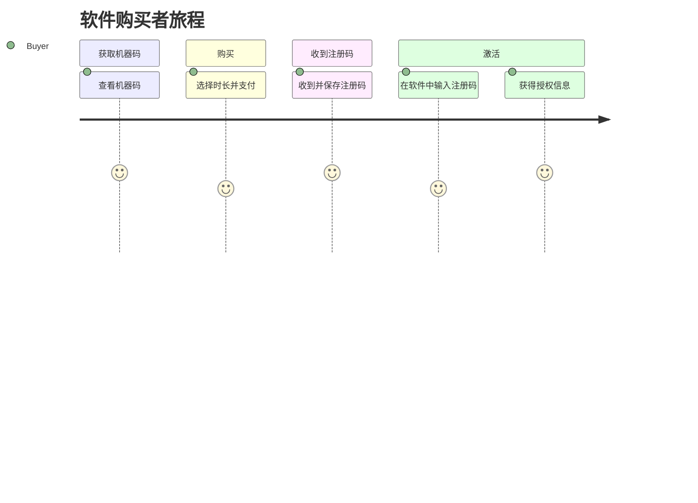
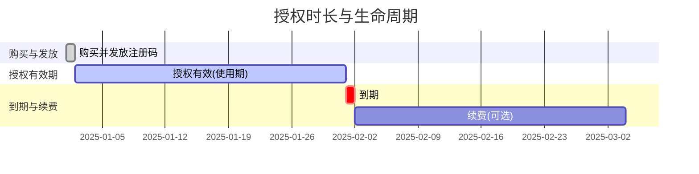

### 整体流程图

### 角色泳道图

### 类图（主要实体与关系）

### 许可证状态图（生命周期）

### 用户旅程图（购买者视角）

### 授权时长与生命周期（甘特图）

## 创建软件注册码商品

商品类型为纯秘文的软件注册码,主要用于售卖付费软件注册码、游戏点卡等, 商品本身是一串用于激活或充值的验证代码。

1. 在商品列表点击"添加商品"跳转到创建商品页面,填写商品名称、商品简介,商品类型选择"纯秘文",秘文类型选择软件注册码,用户根据商品需要填写加密秘钥,机器码,单位额度。

   

   

2. 时长模式是有“按月购买”和“永久有效”这两种模式，主要作用是终端用户获得注册码激活软件可使用的时间。
3. 你可以指定过期时间、是否需要留言，当商品已过期终端用户将无法购买此商品，发码用户选择需要强制留言，此时终端用户必须填写留言才可以购买商品，输入商品价格。
4. 点击“创建”按钮来发布商品后,就会跳转到商品详情页看到加密秘钥和商品链接。

   

## 在软件中内置 RegistrationEasy 程序代码

1. github 提供开源的软件注册码的示例，开源代码[https://github.com/Sophia268/RegistrationEasy](https://github.com/Sophia268/RegistrationEasy), 用户要在软件中内置 RegistrationEasy 程序代码。
2. 程序使用的是 Base64 解码和 AES 解密 ， 先将密文字符串从 Base64 解码为字节数组，使用相同的密钥和 IV 进行 AES 解密，通过 CryptoStream 进行解密流处理。

   

3. 机器码生成原理:先采集硬件信息，再进行哈希处理，然后格式化为 XXXX-XXXX-XXXX-XXXX 的形式，例如 A1B2-C3D4-E5F6-G7H8，支持 Windows、Linux、macOS 多平台机器码生成。

   

以下是示例：

1. 程序中 Config.json 文件目前以明文方式填写了商品加密密钥(Password)和商品购买链接(URI),这仅为示例。出于安全考虑，建议将这两项敏感信息改为在编译时通过 DL（或预编译指令）等方式嵌入，避免在配置文件中明文存储。

2. 终端用户可直接在 RegistrationEasy 程序上点击"Purchase Code"按钮跳转到购买页面。

3. 支付完成后获取秘文(此秘文即注册码)，复制秘文并粘贴到此程序点击"Verify Code",会显示解码结果;

