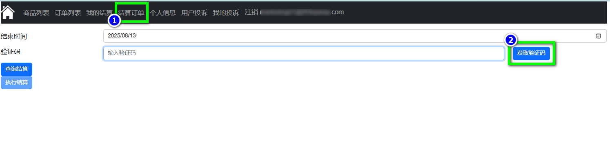
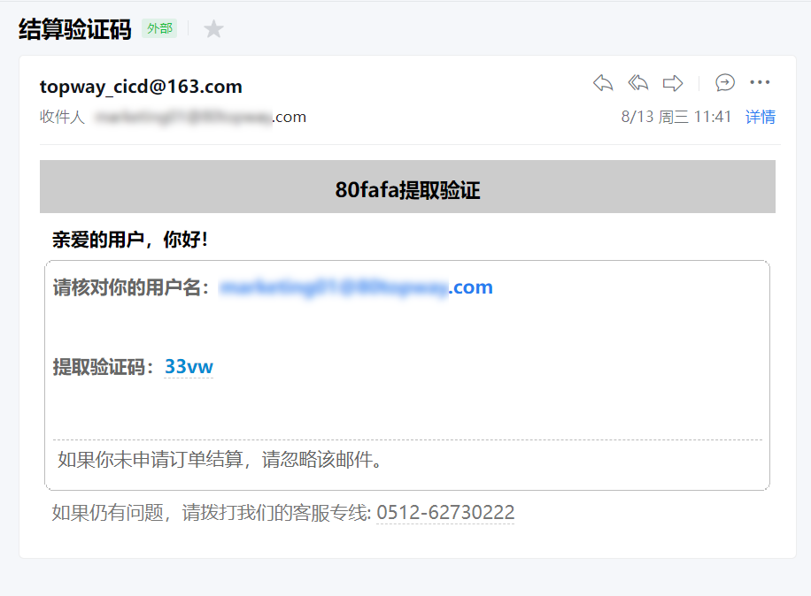
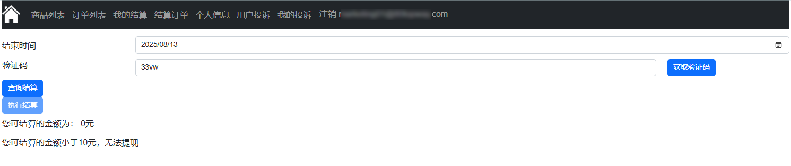
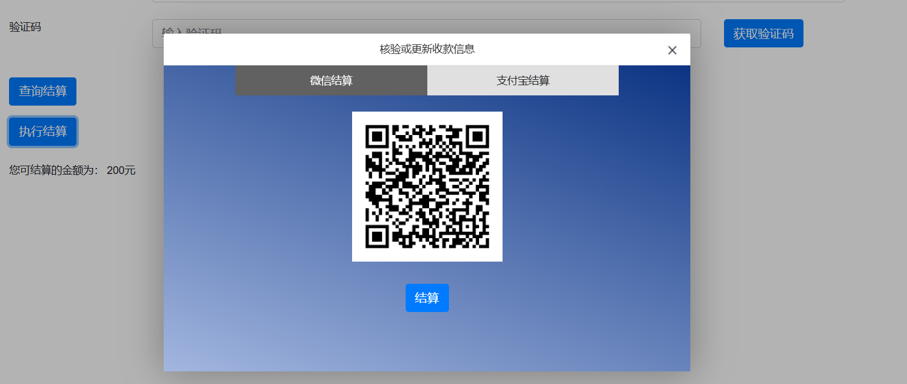
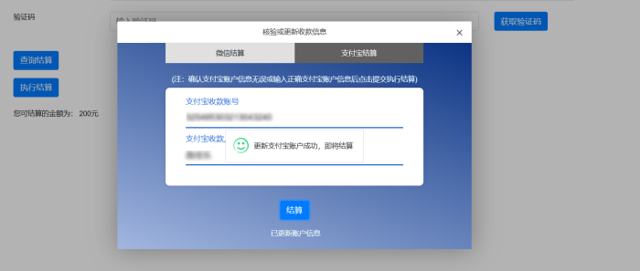
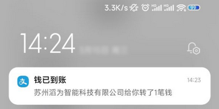

## 引言

##  **结算金额与创作分成**

1. 在80fafa网，在菜单栏中点击结算订单，在结算订单页面获取验证码，验证码是通过邮箱发送。

2. 填入验证码点击查询结算按钮查询截止当日的未结算金额，结算金额大于10元才可结算。

3. 若结算金额已超过10元，点击执行结算按钮，在弹窗中可选择支付宝结算或微信结算。
**注意**：平台会抽取佣金为结算金额的10%。

4.此处以支付宝结算为例演示，可以看到提示用户校验或补全支付宝账户信息，确认支付宝账户信息无误后，点击支付宝方式结算按钮，然后在手机上看到了钱已到账。

