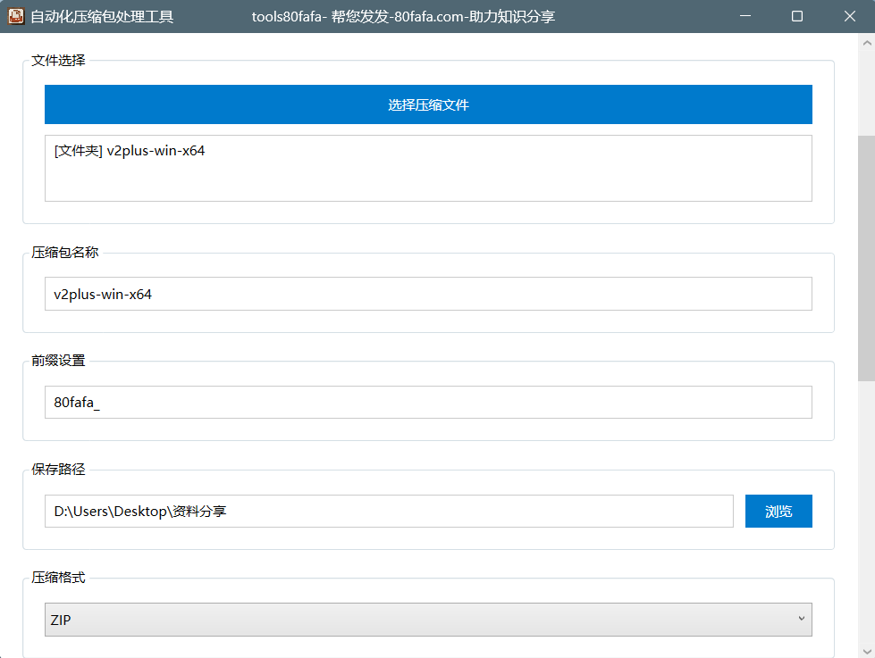
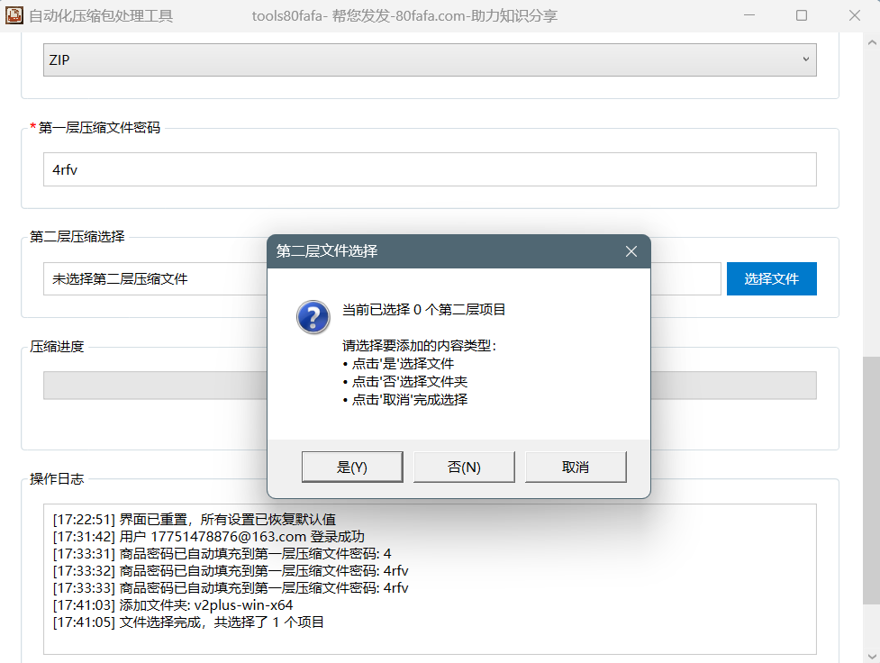
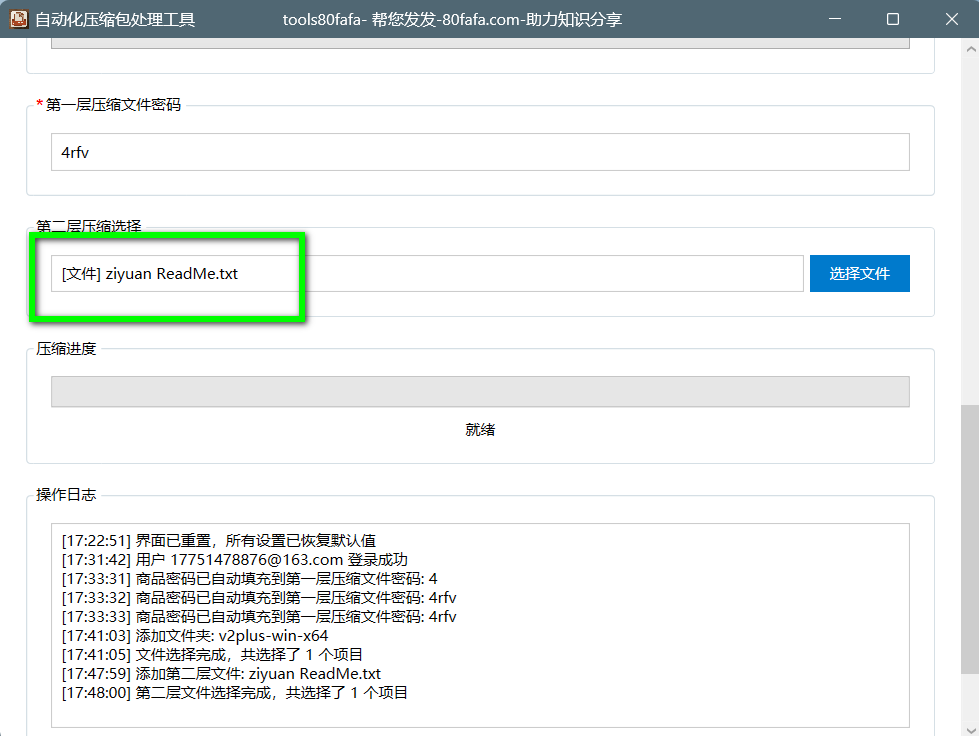
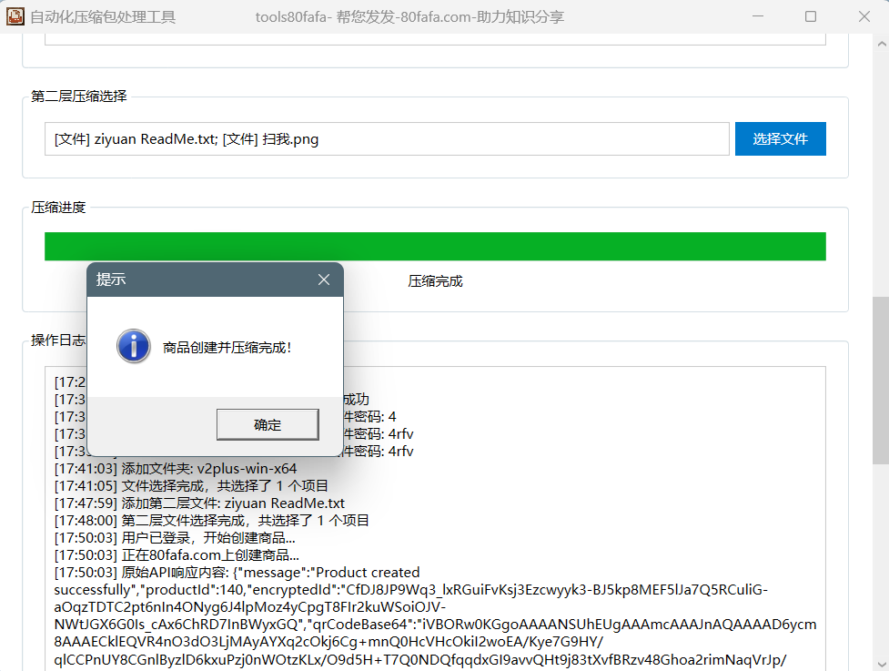
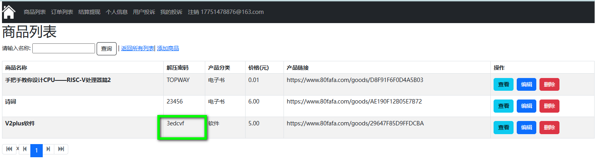
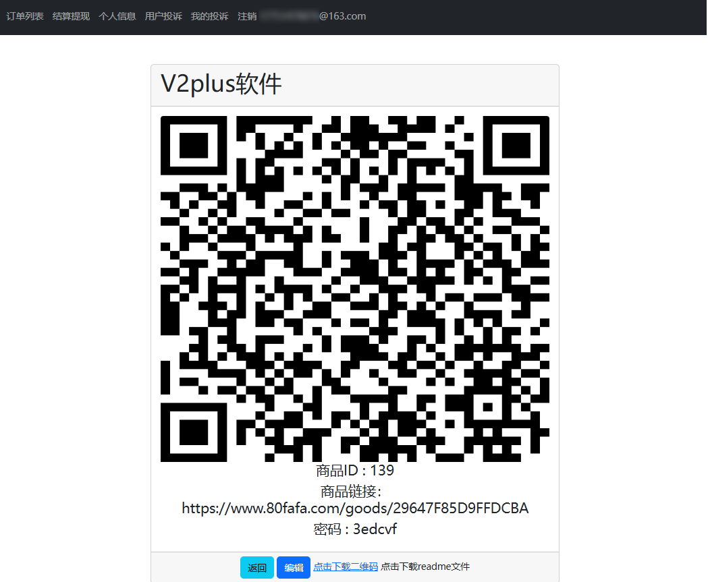
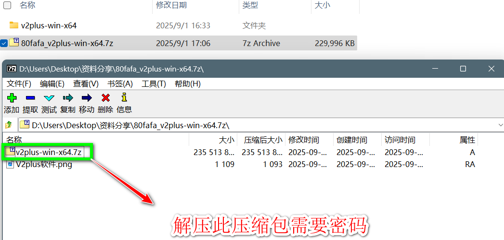

## 引言

tools80fafa压缩软件由80fafa.com网站推出，是一款专注于实现高效“双重压缩”的智能工具。它极大地简化了繁琐的多层文件打包流程，便于存储与传输，旨在为广大用户、尤其是知识分享者提供极致便捷的体验，让分享变得更轻松、更高效。

## 1、下载使用

工具下载地址：
https://github.com/Sophia268/tools80fafa-release/releases/download/latest/tools80fafa-latest-win-x64.7z
## 2、两种模式

tools80fafa压缩软件是一款具有双重压缩功能自动化应用，主要两种使用模式，即登录模式和未登录模式，强烈推荐使用登录模式。

### 登录模式：
1. 若用户登录压缩软件进行使用，则要先登录 [https://www.80fafa.com](https://www.80fafa.com/ "https://www.80fafa.com") 进行注册，因为压缩软件的登录邮箱地址与80fafa.com网站注册登录的邮箱地址是一致的。
2. 登录后，用户就可直接在压缩软件上填写商品信息：商品名称、价格、密码以及类型，然后选择所需要分享的文件。
3. 点击“新建商品并压缩”按钮，商品压缩完成后，商品信息会同步添加至[80fafa.com](https://www.80fafa.com/ "https://www.80fafa.com") 网站，用户可以在网站查看所有添加过的商品。

**登录模式特点**：用户提交压缩的同时会添加商品至[80fafa.com](https://www.80fafa.com/ "https://www.80fafa.com") 网站，用户无需在网站上新建商品,更快捷轻松。

### 未登录模式：
1. 若用户未登录压缩软件，就要通过登录[80fafa.com](https://www.80fafa.com/ "https://www.80fafa.com") 网站详情页添加商品来获取商品二维码。
2. 打开压缩包软件选择要压缩的文件，即用户分享的文件，保存路径及压缩格式可自主选择。
3. 第一层压缩文件的密码与网站添加商品密码要保持一致。
4. 第二层压缩文件选择已保存的二维码图片，然后点击“开始压缩”按钮，商品就压缩打包完成。

**未登录模式特点**：用户需要在[80fafa.com](https://www.80fafa.com/ "https://www.80fafa.com")网站上新建商品。

                                        （流程图示意）
## 3、 登录模式

当用户登录tools80fafa压缩软件时，可以使用以下功能完成商品打包并且商品会自动同步新建到[https://www.80fafa.com](https://www.80fafa.com/ "https://www.80fafa.com") ，所以此时用户就不用在网站上新建商品。

1. 首先要在[https://www.80fafa.com](https://www.80fafa.com/ "https://www.80fafa.com") 进行注册，然后在压缩软件上进行登录，因为压缩软件的登录邮箱地址与80fafa.com的是一致的。

2. 登录后直接填写商品信息，产品类型根据用户所分享资料类型进行选择。商品信息填写完成后，这里填写的商品密码会自动填充到后面第一层压缩文件密码中。

3. 点击“选择压缩文件”按钮，选择需要压缩的文件或者文件夹，即需要分享的商品。

4. 这里第一层压缩密码已经自动填写好了，此时可不用选择第二层压缩文件，程序会自动获取商品的二维码图片并添加到第二层压缩文件中；若是用户想添加第二层压缩的文件内容，可直接选取文件添加。

5. 点击“新建商品压缩”按钮，会弹出弹窗“商品创建并压缩完成”的提示，即已完成压缩。

## 4、 未登录模式

当用户不登录tools80fafa压缩软件时，可以使用以下功能完成商品打包。

1. 直接点击“选择压缩文件”按钮，选择需要压缩的文件或者文件夹，即需要分享的商品。

 2. 压缩包名称默认为选择文件或文件夹的名称，用户也可自行更改压缩包名称；保存路径默认为选择的第一个文件或文件夹的上一级目录，用户也可自行更改保存路径。

3. 压缩格式有ZIP、RAR及7Z三种格式可以选择，用户可自主选择，默认为ZIP格式。

4. 第一层压缩文件密码为用户在 [https://www.80fafa.com](https://www.80fafa.com/ "https://www.80fafa.com") 上新建商品的密码，这两者要保持一致。

5. 下载保存从 [https://www.80fafa.com](https://www.80fafa.com/ "https://www.80fafa.com") 新建商品的二维码图片（此二维码图片为带有解压商品的密码图片，需扫码付款才可获得密码），并在第二层压缩文件选择这个图片，然后点击“开始压缩”按钮。

6. 通过以上操作，就可以生成双重压缩的压缩包。

