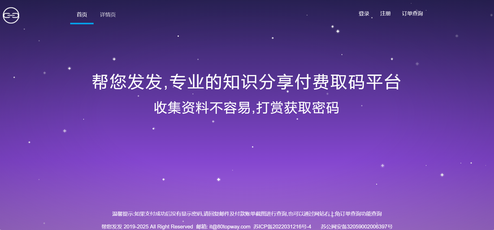

## 引言

80fafa是一个轻量、简洁高效、专业的知识分享付费取码平台，只要你有想要分享的资源，都可以发布创建商品，获得相应二维码，然后将分享内容和二维码打包分享到各大资源分享的平台，让别人扫码购买。

## 特性

这个网站最大的特点就是**超级简单、门槛超低**，你完全不用懂技术。

- **秒变可售商品：** 不管你是PPT模板达人、电子书收藏家、原创音乐人还是攻略小能手，只要你有想分享的**任何数字资源**（文档、图片、音频、视频、软件包...），上传到这个网站，简单填写下描述和价格（几分钱到几十块都行），它瞬间就变成了一个待售的“小商品”。

- **专属收款二维码：** 商品发布创建完成后，网站将给你生成一个**专属的二维码**。这个二维码就是你的“收银台”+“钥匙”。

- **一码护资源：** 你的原始资源始终是安全的！别人不扫码付钱，就绝对看不到、拿不到你的分享的内容，避免了被“白嫖”。

- **分享无门槛：** 拿到二维码后，配上你的资源介绍（比如“史上最全XX攻略，扫码获取”），就能**分享到任何地方**——微信朋友圈、QQ群、微博、小红书、知乎... 只要有人的地方，就能传播。

## 总结

这是一个低门槛，简洁高效的平台，任何人都可以使用。

