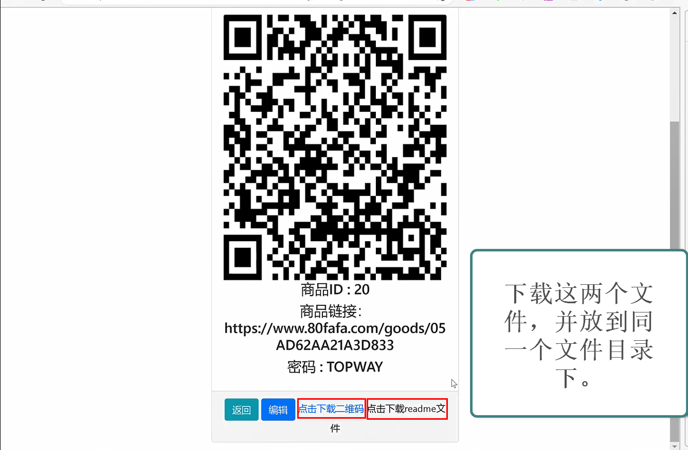
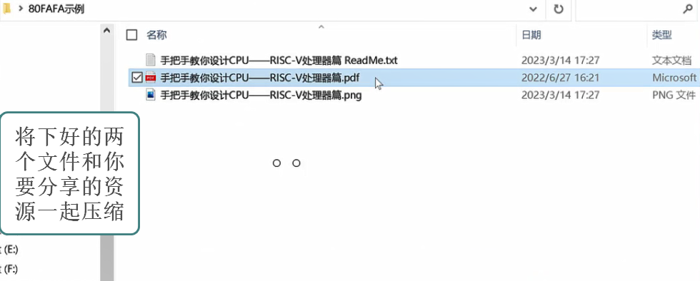
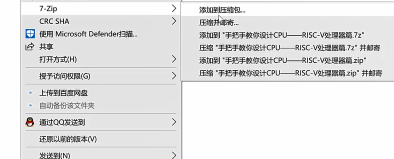

## 快速生成压缩包

1. 在完成商品创建、获得二维码后，在商品详情页面点击下载二维码图片和readme文件，如图

2. 将二维码图片、readme文件及你要分享的内容放到一个文件夹内。

3. 将要分享的内容加密压缩（注意压缩密码要与创建商品中的密码一致）

4.删除分享的原始文件，然后将加密压缩后的文件、二维码图片、readme文件，放在同一个文件夹中，将此文件夹进行压缩（此压缩包不用加密）。

