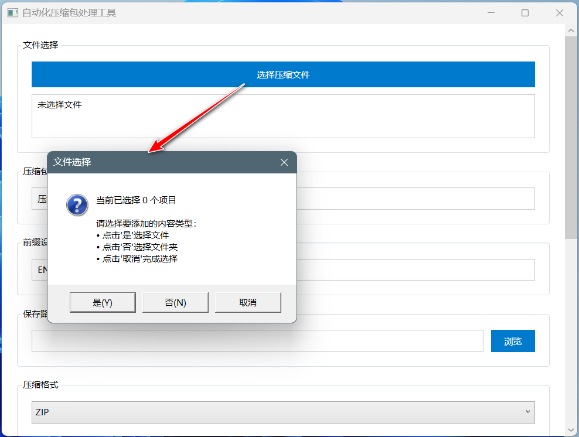
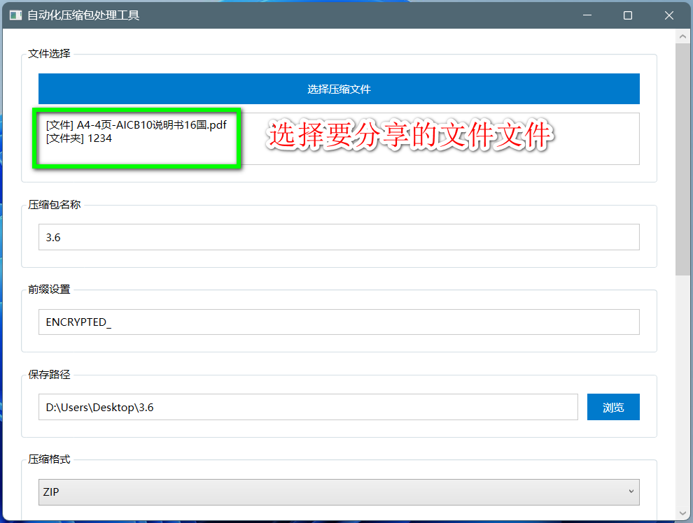
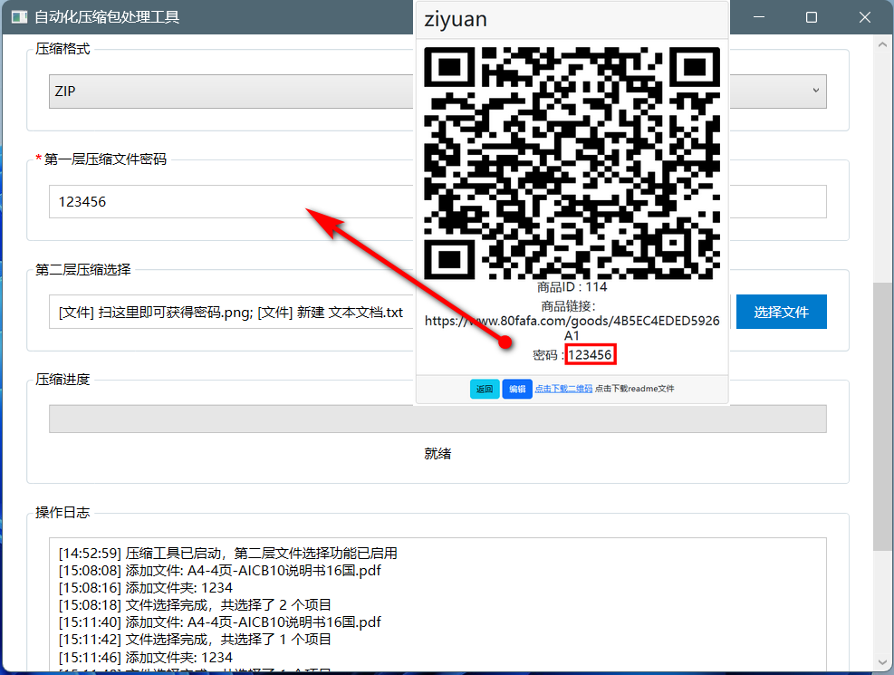
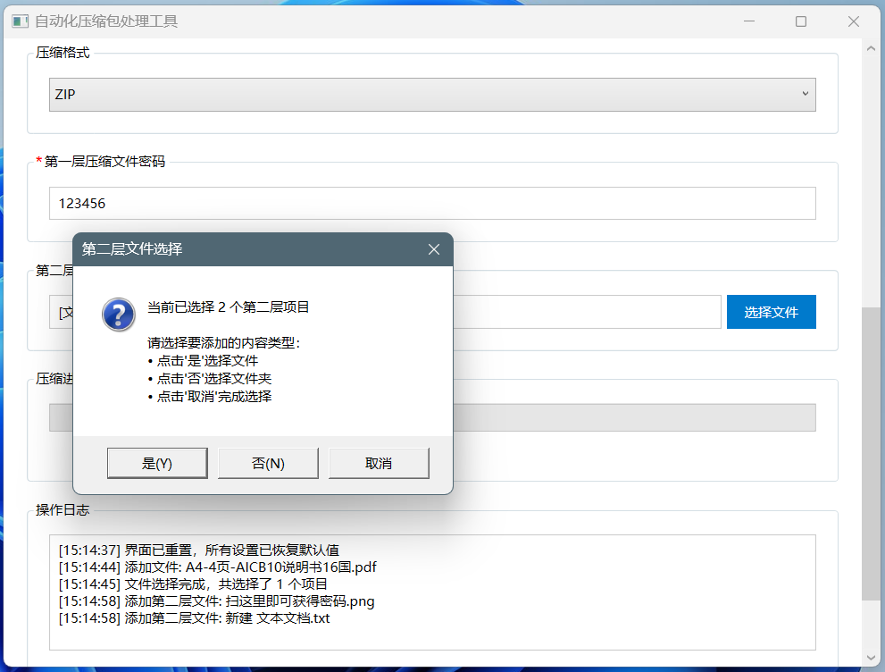
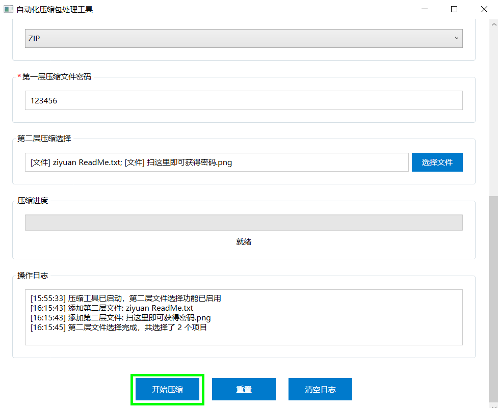
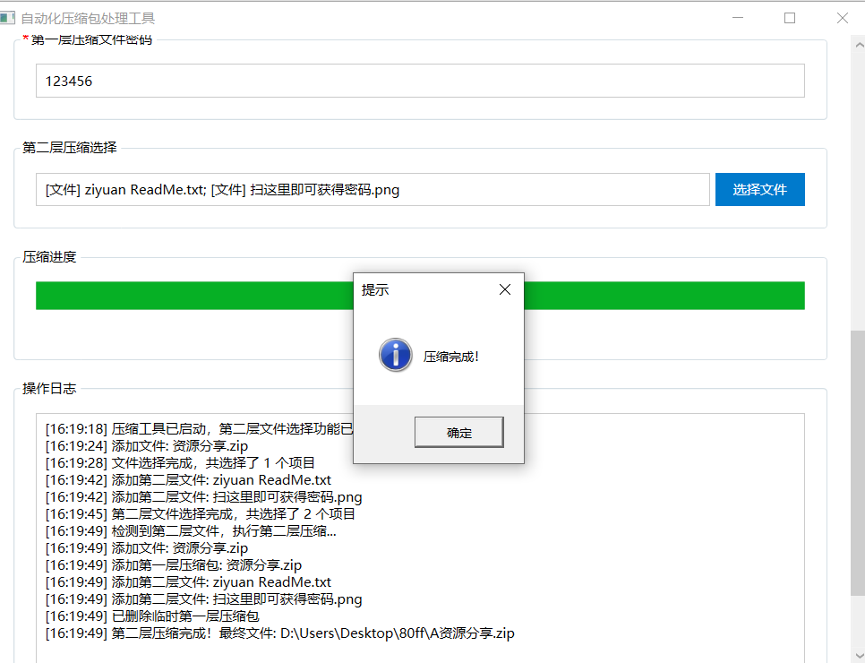

## 引言

在80fafa网站中，下载好二维码和read me后，需要和分享的资源进行两次压缩，常规的压缩方法过于冗繁，为使得文件可以快速压缩，可使用compressiontool这款程序，仅需一次压缩便可得到两次压缩的效果，下面将详细介绍。
## 快速生成压缩包

1. 在完成商品创建、获得二维码后，在商品详情页面点击下载二维码图片和readme文件，最好将这两个文件放在同一个文件夹中，这样可以方面后续寻找，如图

3. 下面可以进行压缩了，选择你要分享的文件/文件夹，可以自定义压缩包名称，以及前缀设置（相当于标记压缩包，便于寻找），保存路径也可自定义。压缩模式三种模式任选。

点击是“选择文件。点击”否“选择文件夹，点击”取消“则表示确定选择。

4. 输入这个压缩文件的密码，即你在80fafa设置的商品密码。

5. 接着进行第二层文件的压缩，这层里放之前在80fafa下载好的二维码和read me，如下图

6. 选择完成后，就可以压缩了，即点击开始压缩

7. 压缩完成！

8. 查看是否在保存在前面设置的文件路径中。

9. 附上视频教程

