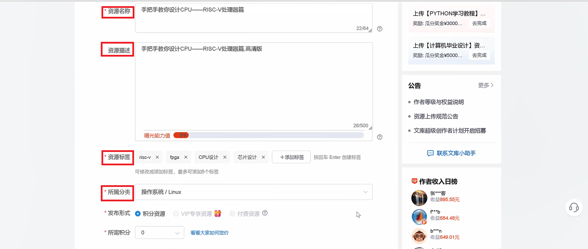
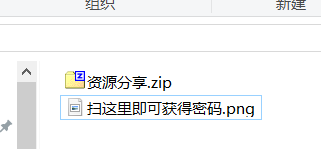

## 扫码取码

准备好一切后，如何让需要资源的人看到你的资源并扫码呢？扫码后，人家如何获得解压码进行付费呢呢？下面将进行示例。

### 1、如何让别人扫码

1. 分享者在完成创建商品，并将二维码与分享资源压缩成压缩包后，可以将链接分享到各大社交平台，比如小红书、百度贴吧、微信朋友圈......下面以CSDN做一个简单的示例，进行说明。

2. 在该平台填写资源名称、资源描述、资源标签、所属分类，**附上资源链接**，点击提交。

3. 这样便完成了商品的曝光，让别人有机会点击你的资源并进行扫码。 

### 2、买家如何获取密码？

当有买家对你所分享的资源感兴趣时，会点击你所分享的链接，第一层压缩包无需密码，解压后，买家看到二维码与readme后，会扫描二维码，进行付费获取第二层压缩包的密码，输入后，买家便能获得相应商品。这样便完成了一次交易。

