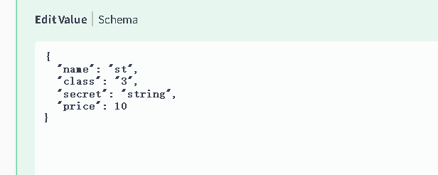
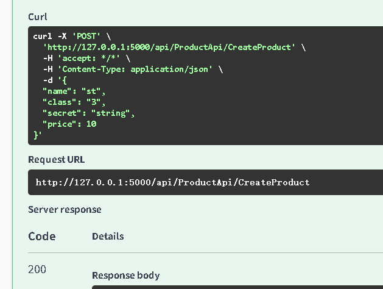
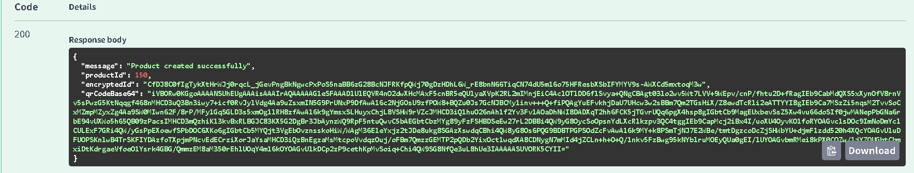
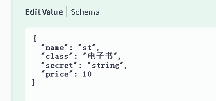
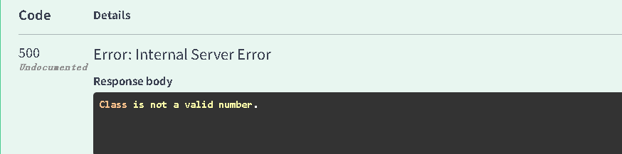
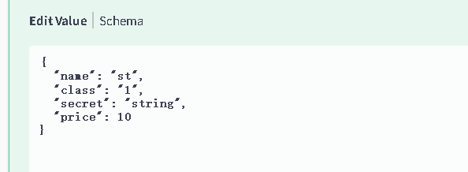

# 商品管理服务器端接口

**CreateProduct( )**  //基于用户唯一标识（token），经合法认证后，自动创建商品信息并返回结果。

### 自动化新建商品

#### 1.1 接口功能

提供商品信息录入功能，接收页面（商品名称、密码、价格、产品类型）输入的数据，完成商品的自动化创建。

#### 1.2 接口URL

请求的URL：**http://127.0.0.1:5000/api/ProductApi/CreateProduct**

#### 1.3 接口参数

| 参数名    | 参数类型    | 是否必填 | 说明                   | 限制/规则                         |
| ------ | ------- | ---- | -------------------- | ----------------------------- |
| name   | string  | 是    | 商品名称，对应页面 “商品名称” 输入框 | 长度建议 1 - 50 字符，支持中文、英文等常规字符   |
| secret | string  | 是    | 解压密码，对应页面 “密码” 输入框   | 按实际商品解压需求设置，如 6 - 20 位字符      |
| price  | decimal | 是    | 商品价格，对应页面 “价格” 输入框   | 需为数字格式（支持整数、小数，如10 9.9）       |
| class  | string  | 是    | 产品类型，对应页面 “产品类型” 下拉框 | 1电子书2软件3视频4音频5图片6文档文件(只能输入数字) |
#### 1.4  **示例**

##### 1.4.1   **输入参数示例** 

输入：
```json
{
  "name": "st",
  "class": "3",
  "secret": "string",
  "price": 10
}
```

如下图：

##### 1.4.2   **手动检测** 

输入：
```json
curl -X 'POST' \
  'http://127.0.0.1:5000/api/ProductApi/CreateProduct' \
  -H 'accept: */*' \
  -H 'Content-Type: application/json' \
  -d '{
  "name": "st",
  "class": "3",
  "secret": "string",
  "price": 10
   }'
```
如下图所示：


##### 1.4.3   **成功示例**（status = 200）

**RequestURL**：http://127.0.0.1:5000/api/ProductApi/CreateProduct



输入：
```json
Code：200
Response body：{
  "message": "Product created successfully",
  "productId": 150,
  "encryptedId": "CfDJ8C0fIgTykXtHrWJj0rqcL_jGevPngBkNgwcPxPoS5naBB6zG28BcNJFRKfpQWj70gDzHDhL6W_rE8bnN66TiqCN74dU5m16o75HFResbXSbIFYMYV9s-AWXCd5mxtoqM3w",
  "qrCodeBase64": "iVBORw0KGgoAAAANSUhEUgAAAisAAAIrAQAAAAAG1eSFAAADlUlEQVR4nO2dwXHcMAxF5cnBR5eQUlyaXVpK2RUVORK5CYII="
}
```
**说明：**

1.  在生成二维码图片后，新增代码读取图片文件并转换为Base64字符串 
2. 在返回结果中新增 QRCodeBase64 字段，包含二维码图片的Base64编码


3. 新增代码如下：

输入：
```csharp
// 新增：读取二维码图片并转换为Base64
byte[ ] imageBytes = System.IO.File.ReadAllBytes(path);
string base64Image = Convert.ToBase64String(imageBytes);
productRepository.Insert(newProduct);
return Ok(new {
Message  "Product created successfully",
ProductId = newProduct.Id,
EncryptedId = protector.Protect(newProduct.Id.ToString()),
QRCodeBase64 = base64Image // 新增返回Base64编码的二维码图片
});
```
##### 1.4.4   **系统成功效果展示**

商品列表：


商品二维码：

##### 1.4.5   **失败示例**（status ≠ 200）
  
1. **参数缺失/错误**  

   示例：

输入：   
```json   
{
  "name": "st",
  "class": "电子书",
  "secret": "string",
  "price": 10
}
```
如下图：


返回结果：
   class 不是一个有效值


2.  **身份认证失败**
——未登录时添加商品

输入：
```json 
{
  "name": "st",
  "class": "1",
  "secret": "string",
  "price": 10
}
```
如下图：


返回结果：

