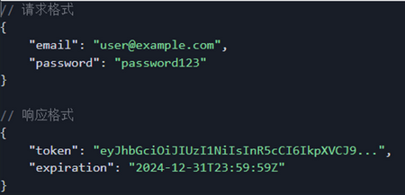
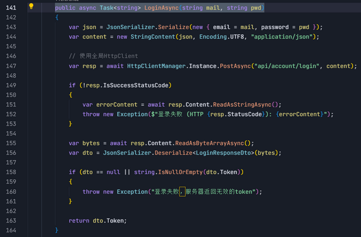
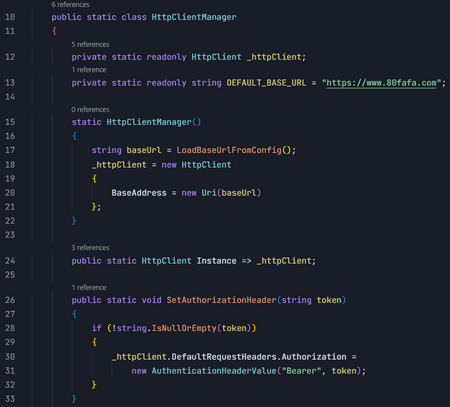
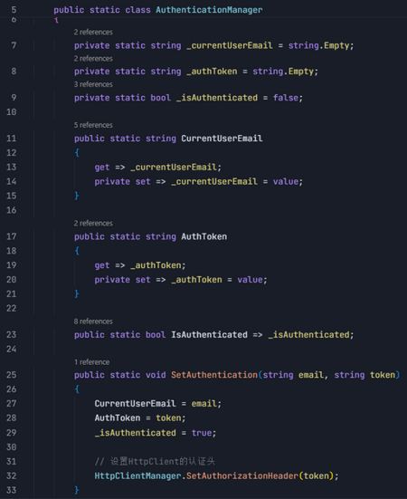
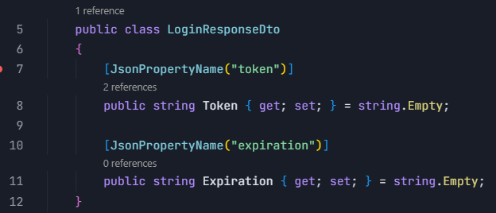
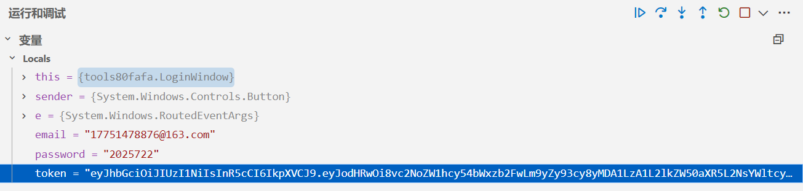

## 80fafa登录API调用方法概述

主要是通过用户输入的邮箱和密码调用API验证并获取Token来实现登录。

## 具体说明

 1. 用户输入在登录界面输入邮箱密码并点击登录按钮，程序会把用户的信息打包成JSON格式发送给服务器 [https://www.80fafa.com/api/account/login](https://www.80fafa.com/api/account/login "https://www.80fafa.com/api/account/login") 。

2. 服务器会检查用户信息，如果正确，会返回“通行证”（Token）；如果错误：返回错误信息；

3. 如果登录成功，程序会保存Token并记住用户的邮箱，将Token放到后续的添加Authorization头中；

**请求头代码**

**认证状态管理代码**

**API响应格式代码**

4. 调试运行时，调用API验证用户输入的邮箱密码成功获取的Token。

