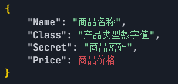
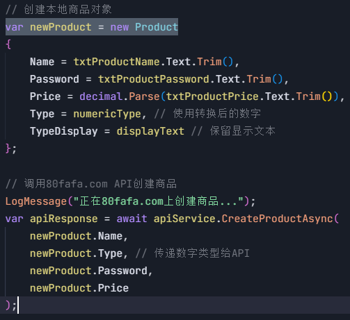
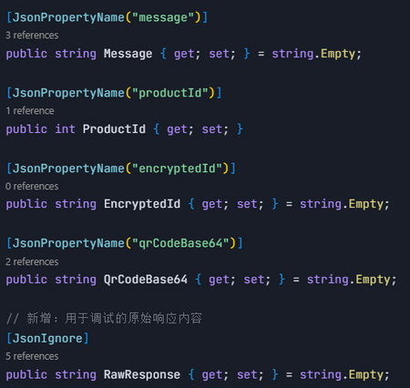
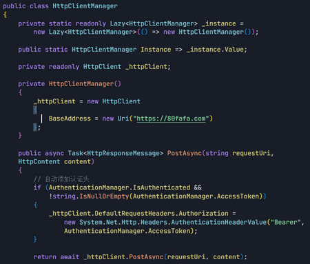

## 80fafa 新建商品 API 调用方法概述

程序通过验证用户登录的状态，收集商品信息，然后调用 80fafa.com 的 API 接口来创建商品，并自动处理返回的二维码图片。

## 具体说明

1. 程序收集用户填写的商品信息

商品新建的请求格式

2. 程序把商品信息打包并发送到  [https://80fafa.com/api/ProductApi/CreateProduct](https://80fafa.com/api/ProductApi/CreateProduct "https://80fafa.com/api/ProductApi/CreateProduct") ，等待服务器回复。

调用的入口代码

商品数据传输代码

3. API 响应代码：用于接收和解析创建商品接口的响应数据；从 API 响应中获取 Base64 格式的二维码。

4. 认证和 HTTP 请求代码：统一管理用户身份、认证令牌（Token），并确保所有 HTTP 请求都能正确携带认证信息。

5. 调试运行结果：
   程序获取用户填写商品信息；

API 响应返回的数据，商品已创建成功并处理返回的 QrCodeBase64；

