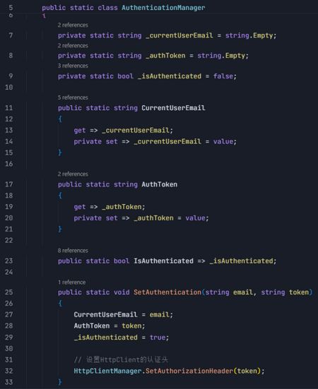

## 80fafa 登录 API 调用方法概述

主要是通过用户输入的邮箱和密码调用 API 验证并获取 Token 来实现登录。

## 具体说明

1.  用户输入在登录界面输入邮箱密码并点击登录按钮，程序会把用户的信息打包成 JSON 格式发送给服务器  [https://www.80fafa.com/api/account/login](https://www.80fafa.com/api/account/login "https://www.80fafa.com/api/account/login") 。

2. 服务器会检查用户信息，如果正确，会返回“通行证”（Token）；如果错误：返回错误信息；

3. 如果登录成功，程序会保存 Token 并记住用户的邮箱，将 Token 放到后续的添加 Authorization 头中；

**请求头代码**

**认证状态管理代码**

**API 响应格式代码**

4. 调试运行时，调用 API 验证用户输入的邮箱密码成功获取的 Token。

