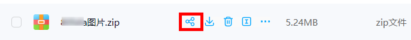

## 引言

在将二维码和资源都压缩好后，要放到合适的网盘，以便生成分享链接，让别人点击，下面介绍几款比较好用的网盘。

## 1、百度网盘

这个网盘想必大家都知道，这里简单介绍下。

1. 首先，将文件包拖拽上传到网盘。

2. 打开网盘主界面，找到刚刚上传的文件，点击分享。

3. 系统会自动生成解压密码，设置链接有效时间，点击创建链接。

4. 复制链接和提取码，这样就可以在各大平台上进行分享。

## 2、夸克网盘

1. 夸克网盘也是大家常用的网盘，操作方法与百度网盘雷同，在全部文件中找到上传文件，上传你想要上传的文件。

2. 点击分享。

 3. 接下来操作和百度网盘一样。

## 3、迅雷云盘

1. 同样的，迅雷云盘也是在上传好文件后，点击分析。

2. 将生成的连接分享出去，操作方法与以上网盘相同。
