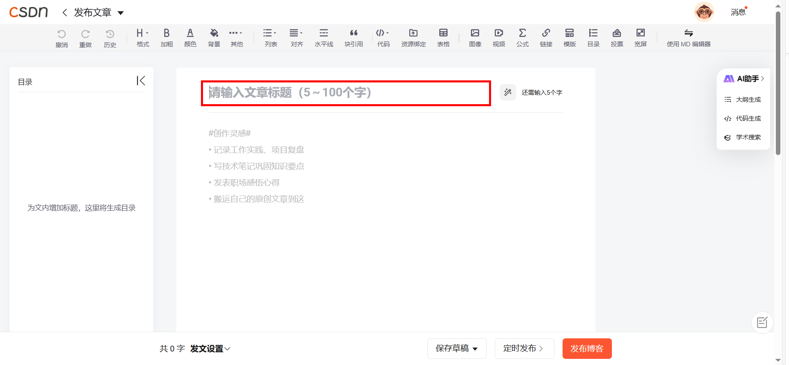
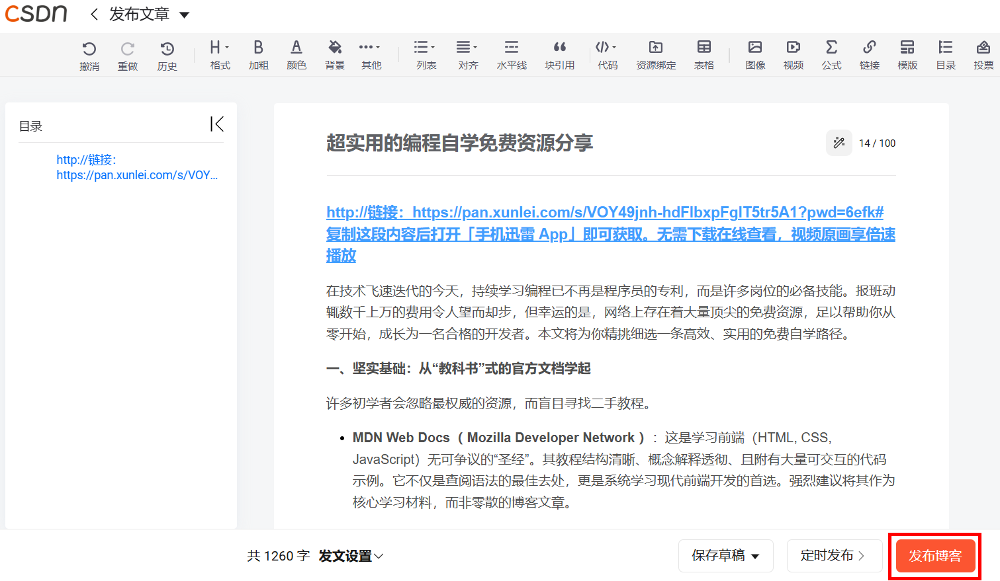
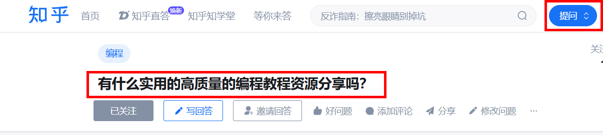

## 引言

在80fafa网站上完成商品的创建，并且打包好相关文件后，我们就要进行资源的分享。这一步是十分重要的，如果不能让人看到你分享的东西，那么就没有任何价值。所以我们要选择一些广为人知且使用频繁的平台。下面我将逐一介绍还不错的分享平台，并示例，供大家参考。

##  1、CSDN

CSDN是中国IT技术生态中不可或缺的重要一环。尽管存在一些体验上的不足，但其无与伦比的中文技术资源丰富度、活跃的社区和强大的问题解决能力，使其成为中文开发者日常学习、工作和解决问题的强大工具和平台，因此，作为我们分享知识资源的平台再好不过了。

1. 登录CSDN。

2. 发布博客，附上你想要分享的资源链接。

3. 如图，拟一个吸睛的标题，插入你所分享的资源链接，点击分享博客。

##  2、知乎

1. 登录进入知乎，点击右上角的提问，先进行一个提问，如下图。

2. 接着用另一个号进行回答，即将相应资源回复在该问题下，附上链接，让别人看到。

##  3、百度贴吧

同样的，在百度贴吧中，也可以采用自问自答的方式，来达到宣传分享资源的目的。

