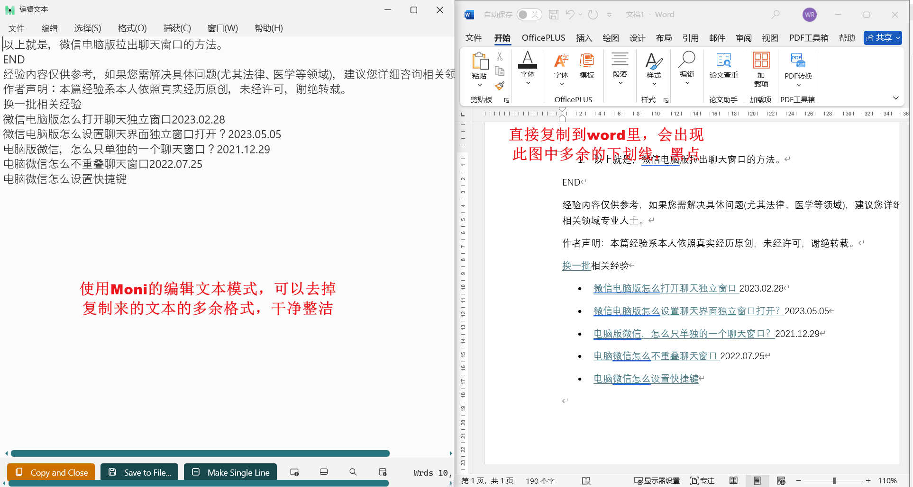

## 引言

上篇介绍了 Moni 这款软件四种模式如何使用，这篇将介绍在不同场景下对 Moni 的使用，以确保大家对 Moni 有更深入的了解，能最大程度的运用该软件，达到事半功倍的效果。

## 1、全屏抓取模式 —— 学术研究者的获取文本的最佳方式

**痛点：**  当你在写论文、做研究时，经常需要从各种 PDF 文献、数据库网页甚至扫描版的书籍中摘录大量文字和数据，手动录入耗时且容易出错，目前可用的屏幕文字提取的工具效果不好，错字、乱码很多，亦或是只能截屏不能提取文字，带来很多不便和困扰。

**解决方案：**  使用 Moni，开启**全屏抓取模式**，提取所要复制的文本内容。

1. **遇到即取：**  在阅读 PDF 文献或在线期刊时，就像截图一样，用鼠标框选无法直接复制的文本段落（包括复杂排版下的文字）。

2. **一键转化：**  松开鼠标，即完成文本识别，相应文本会存入到你的剪贴板。

3. **无缝对接：**  直接粘贴到你的 Word 文档或笔记软件（如 Notion、Obsidian）中，进行引用、翻译或批注，让文献综述和资料收集效率大大提高。

## 2、抓取框抓取模式 —— 销售人员的“情报站”

**痛点：**  外贸人员/电商销售等行业需要时刻关注买家的动态、社交媒体发言，获取有效信息，有针对性的出售货物，但手动搜索和记录不仅效率低下，还容易遗漏关键信息。

**解决方案：**  可以使用 Moni 的**抓取框抓取模式**，设置关键词，精准获得有效信息和市场需求，有方向的对特定人群进行推销售卖。

1. **精准监控：**  将抓取框拖动到目标窗口（如某采购网站后台、买家的 Skype/WhatsApp 聊天窗口、行业论坛的特定板块）。国内则可以监控 QQ、微信等使用广泛的社交软件。

2. **设置关键词：**  在软件中设置你需要的“有效信息”，针对不同人群设置不同的关键词，如设置一些日常用品的词语，这是大部分人都会需要的商品。再比如针对留学群，可能可以输入“雅思”、“托福”等字眼，向他们售卖电子文件等等。

3. **坐等收获：**  然后你就可以最小化软件，去处理其他工作。一旦目标窗口中出现包含你设定关键词的文本，Moni 会立即提示，并**自动识别、抓取将内容保存到剪贴板或指定文件**。

4. **主动出击：**  获得这些更精确的需求后，你就可以做好准备，去主动联系买家。精准销售，提高成功率。

## 3、编辑文本窗口 —— 清除多余格式

**痛点：**  从网页或文章中复制内容时，总会携带背景格式（字体、颜色、超链接），粘贴到自己的编辑器或 word 文档后，还需要手动删除、调整格式，十分费时费力。

**解决方案：**  使用**编辑文本窗口**作为你的“文本净化器”，来清除冗余格式。

1. **集中处理：**  无论是用“全屏”还是“抓取框”模式获取的文本，都可以先发送到这个编辑窗口中。以及你从文献或网页自己复制下来的文字，也都能放到这个编辑窗口。

2. **纯净编辑：**  复制过来的文本中，多余的格式都会被清楚，只保留文本、换行和制表符。你还可以利用窗口内工具轻松进行排版调整、错别字修正和内容梳理。

3. **完美输出：**  整理结束后，可以将文本复制到你的微信公众号编辑器、Word 中，以确保排版整洁统一，省去了反复点击“只粘贴文本”的麻烦。

## 4、快速简单查询

这个模式主要是针对前面两中模式，在获取了屏幕的文本后，相应文本会在这个功能的历史文件中出现，无须担心之前的文本找不到，又要重新获取。只需要在输入框输入关键词，即可获得之前抓取到的文本内容。

按 enter 能跳到文本编辑的窗口进行复制。

