## 引言

Moni是一个可以自动抓取识别并监控当前界面文本的软件，可以根据需求捕捉内容，轻便快捷，识别准确率高。

它一共有四种抓取的功能模式：1)全屏模式  2)抓取框架  3)编辑窗口  4)快速简单查找

## 1、简介

1. 首先打开Moni App，首界面如图所示。

2. 此页面为设置界面，在这个界面你可以设置界面的主题色，切换语言，以及其他一些基础设置。

## 2、全屏模式

1. 点击“尝试全屏抓取”，就会跳转到如图所示界面，此时光标会变成十字，在想要复制的文字周围画一个矩形框。

2. 例如，我想要获取下图中的文字，就可以点击全屏功能，屏幕会呈现下图状态，上方有相应的操作栏，鼠标会变成十字光标，然后就能进行界面框取。

3. 框取完成后，右下角会出现这样一个通知框，这里就是刚刚抓取到的文字。如果错过该通知框，可以按快捷键Windows+v调出剪切板，剪切板会显示最近一次的剪切内容。

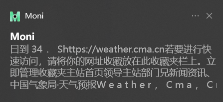

4. 你可以点击展开，进行crtl+c复制。

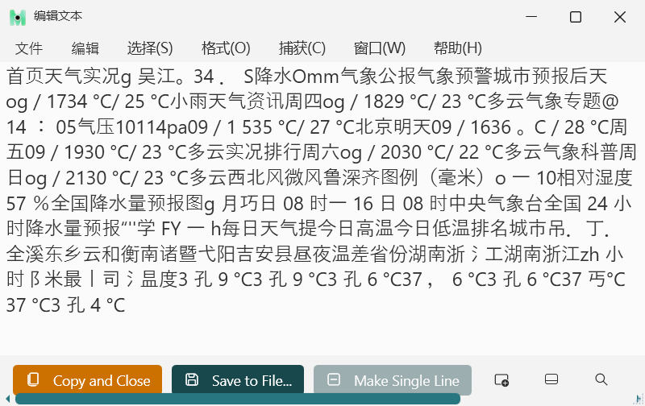

## 3、抓取框架

“抓取框”是一个可移动、调整大小、形状的窗口。它会置于其他窗口之上，并且会读取窗口边框内的所有文本。
抓取框架模式，对于表格文本获取友好，此模式具有直接在框选的文本上添加表格的功能。  

**文字边框两种使用方法**  

**方法一**：点击或拖动以选择文字边框范围，点击“抓取”（Grab）会有消息通知窗弹出，点击通知就可以编辑并复制文本。  

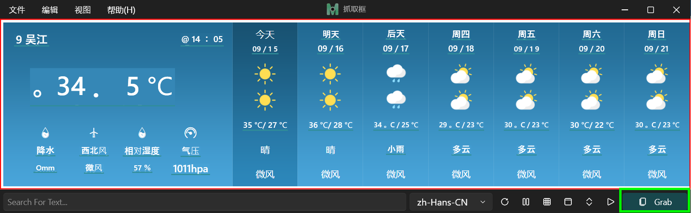

注意：1.使用鼠标滚轮就可以放大或缩小边框范围。
           2.暂停抓取框并使用滚动以放大一段文本。  
此按钮为暂停抓取框按钮或者冻结窗口按钮。可以编辑每一行来纠正识别错误的部分，使结果更完美，如下图。

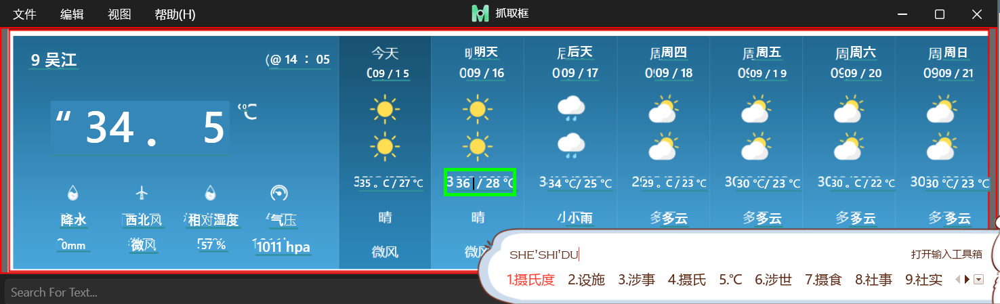

小tips1：使用鼠标滚轮就可以放大或缩小边框范围 ，如下图。

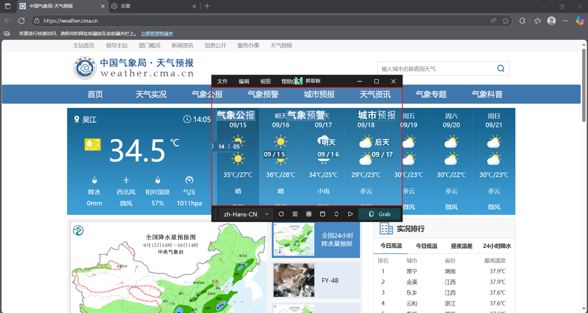

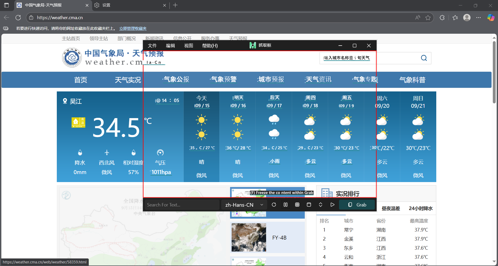

小tips2：暂停抓取框并使用滚动以放大一段文本，如下图。

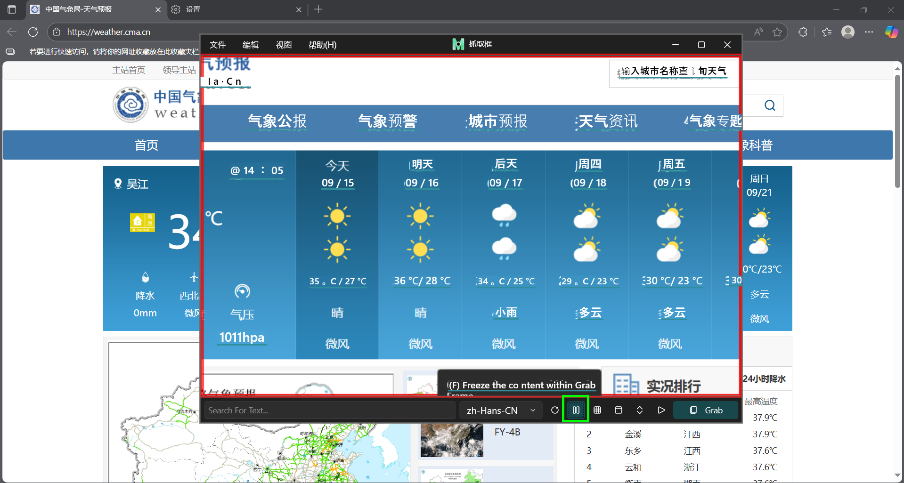

**方法二**：将图像拖拽到抓取框内，进行抓取图像并复制获得的文本。

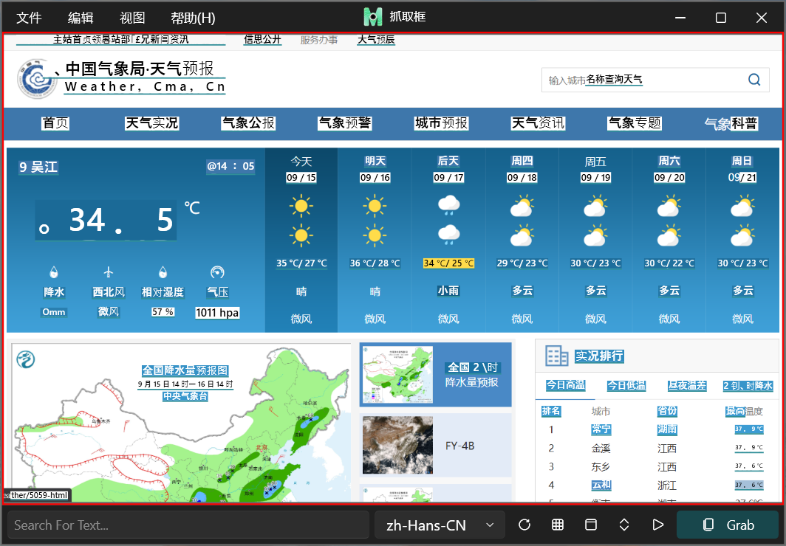

此外，抓取框还可使用表格模式，表格模式是在抓取框文字附上表格，然后点击表格按钮。如下图所示。此时点击“抓取”（Grab）会有消息通知窗弹出。

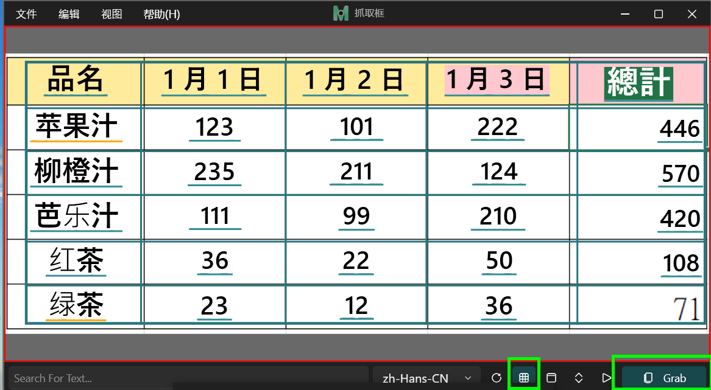

点击通知就可以编辑并复制带有格式的文本，抓取的文字会按照表格的位置展示出来，如下图。

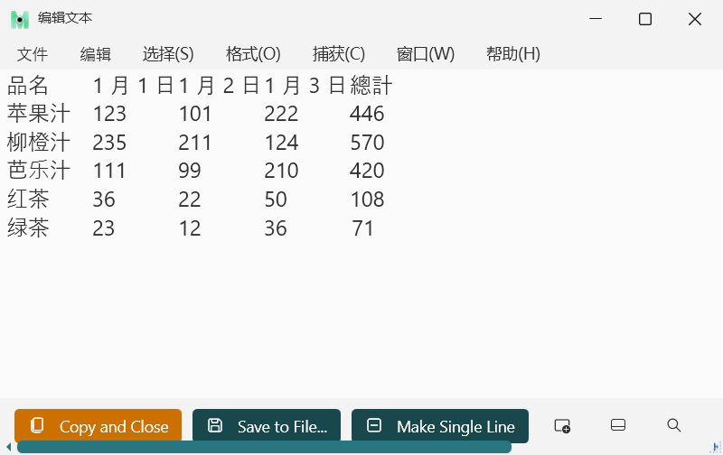

## 4、编辑文本窗口

与记事本的功能类似，文本编辑窗口提供的是“纯文本”编辑，没有格式设置。这意味着将文本复制到该窗口或从该窗口中删除时，会删除所有格式，但换行符和制表符会保留。使用全屏抓取或抓取框架来收集文本，会有历史记录，在最近文件下拉框中就有抓取文本的历史记录，如下图所示

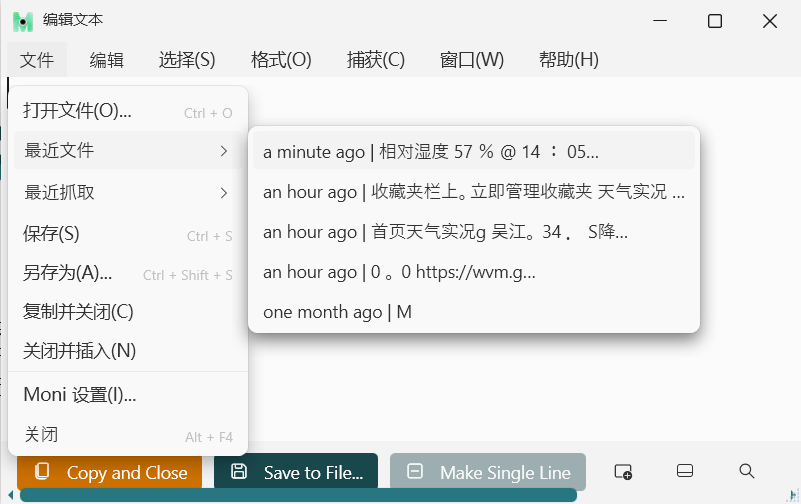

## 5、快速简单查找

与全屏模式或抓取框架模式不同，快速简单查找模式并不使用 OCR 技术。输入搜索关键词相关文本，以便快速筛选结果。可按回车键即可复制查找值并迅速关闭窗口。

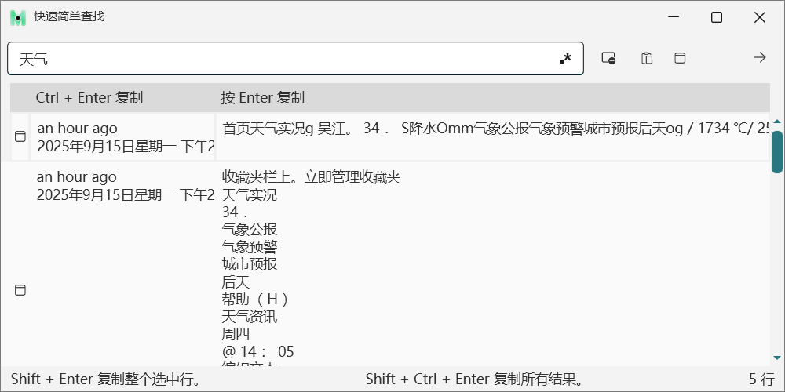

